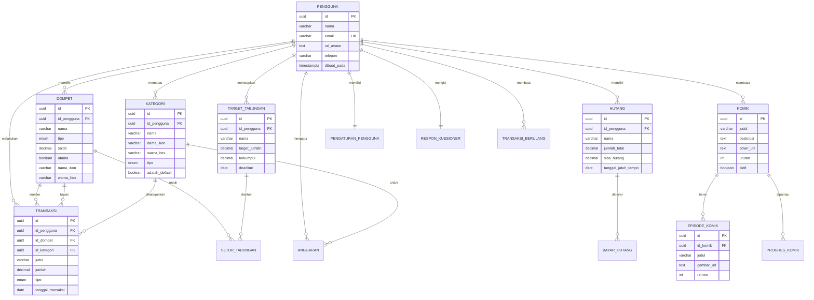

# DahuKu 💰

<div align="center">

Aplikasi manajemen keuangan pribadi berbasis Flutter dengan fitur **offline-first** dan **edukasi finansial** melalui komik interaktif.

[](https://flutter.dev)
[](https://dart.dev)
[](https://supabase.com)
[](https://bloclibrary.dev)

</div>

---

## 📋 Daftar Isi

- [Screenshots](#-screenshots)
- [Fitur Utama](#-fitur-utama)
- [Arsitektur](#-arsitektur)
- [Tech Stack](#-tech-stack)
- [Struktur Project](#-struktur-project)
- [Database Schema](#-database-schema)
- [Getting Started](#-getting-started)
- [Konfigurasi Environment](#-konfigurasi-environment)
- [State Management](#-state-management)
- [Offline Support](#-offline-support)
- [API Reference](#-api-reference)
- [Testing](#-testing)
- [Build & Deployment](#-build--deployment)
- [Contributing](#-contributing)
- [Troubleshooting](#-troubleshooting)
- [Changelog](#-changelog)

---

## 📱 Screenshots

<div align="center">

|                Onboarding                 |                Dashboard                |                Analytics                |
| :---------------------------------------: | :-------------------------------------: | :-------------------------------------: |
|  |  |  |

|                Transaksi                |                Education                |               Profile               |
| :-------------------------------------: | :-------------------------------------: | :---------------------------------: |
|  |  |  |

</div>

> 💡 **Catatan**: Tambahkan screenshot di folder `screenshots/`

---

## ✨ Fitur Utama

### 🏠 Dashboard

| Fitur                   | Deskripsi                                              |
| ----------------------- | ------------------------------------------------------ |
| **Multi-Wallet**        | Kelola 3 jenis dompet: Belanja, Tabungan, Dana Darurat |
| **Quick Summary**       | Ringkasan pengeluaran harian/mingguan/bulanan          |
| **Recent Transactions** | Daftar 5 transaksi terbaru dengan quick access         |
| **Wallet Cards**        | Visualisasi saldo tiap wallet dengan warna berbeda     |

### 📊 Analytics & Reports

| Fitur                   | Deskripsi                                 |
| ----------------------- | ----------------------------------------- |
| **Expense Chart**       | Grafik pengeluaran dalam berbagai periode |
| **Category Breakdown**  | Pie chart spending per kategori           |
| **Transaction History** | Filter & search riwayat transaksi         |
| **Monthly Comparison**  | Perbandingan pengeluaran antar bulan      |

### 💸 Manajemen Transaksi

| Fitur          | Deskripsi                                    |
| -------------- | -------------------------------------------- |
| **Quick Add**  | Catat pemasukan/pengeluaran dengan cepat     |
| **Transfer**   | Pindah uang antar wallet                     |
| **Categories** | 13 kategori default + custom kategori        |
| **Recurring**  | Transaksi berulang (harian/mingguan/bulanan) |

### 💰 Fitur Tabungan

| Fitur                | Deskripsi                           |
| -------------------- | ----------------------------------- |
| **Target Tabungan**  | Set target menabung dengan deadline |
| **Setor Tabungan**   | Catat setiap setoran ke tabungan    |
| **Progress Tracker** | Pantau progres pencapaian target    |

### 💳 Manajemen Hutang

| Fitur              | Deskripsi                             |
| ------------------ | ------------------------------------- |
| **Catat Hutang**   | Record hutang dengan detail           |
| **Bayar Hutang**   | Catat pembayaran cicilan              |
| **Hutang Tracker** | Pantau sisa hutang yang harus dibayar |

### 📚 Education (Komik Finansial)

| Fitur                  | Deskripsi                           |
| ---------------------- | ----------------------------------- |
| **Interactive Comics** | Belajar keuangan melalui komik      |
| **Episode System**     | Komik terbagi dalam episode-episode |
| **Progress Tracking**  | Lacak komik yang sudah dibaca       |
| **Financial Tips**     | Tips mengatur keuangan              |

### 🔐 Security & Authentication

| Fitur                  | Deskripsi                    |
| ---------------------- | ---------------------------- |
| **PIN Protection**     | Akses app dengan 6-digit PIN |
| **Biometric Auth**     | Fingerprint/Face ID support  |
| **Secure Storage**     | Data sensitif terenkripsi    |
| **Session Management** | Auto-logout & session expiry |

### 🌐 Offline-First Architecture

| Fitur                   | Deskripsi                         |
| ----------------------- | --------------------------------- |
| **Local Database**      | Hive untuk penyimpanan lokal      |
| **Auto Sync**           | Sinkronisasi otomatis saat online |
| **Conflict Resolution** | Penanganan konflik data           |
| **Offline Indicator**   | Notifikasi status koneksi         |

---

## 🏗 Arsitektur

### Clean Architecture Pattern

```
┌─────────────────────────────────────────────────────────────┐
│                    PRESENTATION LAYER                        │
│  ┌─────────────┐  ┌─────────────┐  ┌─────────────────────┐  │
│  │   Pages     │  │  Widgets    │  │   BLoC / Cubit      │  │
│  └─────────────┘  └─────────────┘  └─────────────────────┘  │
├─────────────────────────────────────────────────────────────┤
│                     DOMAIN LAYER                             │
│  ┌─────────────┐  ┌─────────────┐  ┌─────────────────────┐  │
│  │  Entities   │  │  Use Cases  │  │   Repositories      │  │
│  └─────────────┘  └─────────────┘  │   (Interfaces)      │  │
│                                     └─────────────────────┘  │
├─────────────────────────────────────────────────────────────┤
│                      DATA LAYER                              │
│  ┌─────────────┐  ┌─────────────┐  ┌─────────────────────┐  │
│  │   Models    │  │ Repositories│  │   Data Sources      │  │
│  │             │  │   (Impl)    │  │  Remote │  Local    │  │
│  └─────────────┘  └─────────────┘  └─────────────────────┘  │
├─────────────────────────────────────────────────────────────┤
│                      CORE LAYER                              │
│  ┌─────────────┐  ┌─────────────┐  ┌─────────────────────┐  │
│  │   Theme     │  │     DI      │  │     Services        │  │
│  └─────────────┘  └─────────────┘  └─────────────────────┘  │
└─────────────────────────────────────────────────────────────┘
```

### Data Flow

```
User Action → BLoC Event → Use Case → Repository → Data Source
                                                       ↓
UI Update  ←  BLoC State  ←  Entity  ←  Repository  ← Response
```

---

## 🛠 Tech Stack

### Core Framework

| Technology | Version | Purpose                     |
| ---------- | ------- | --------------------------- |
| Flutter    | 3.9+    | Cross-platform UI framework |
| Dart       | 3.0+    | Programming language        |

### State Management

| Package      | Version | Purpose                     |
| ------------ | ------- | --------------------------- |
| flutter_bloc | ^9.1.1  | BLoC pattern implementation |
| bloc         | ^9.0.0  | Core BLoC library           |
| equatable    | ^2.0.7  | Value equality for states   |

### Backend & Database

| Package            | Version | Purpose                  |
| ------------------ | ------- | ------------------------ |
| supabase_flutter   | ^2.8.4  | Backend-as-a-Service     |
| hive_flutter       | ^1.1.0  | Local NoSQL database     |
| shared_preferences | ^2.3.4  | Simple key-value storage |

### Security

| Package                | Version | Purpose                              |
| ---------------------- | ------- | ------------------------------------ |
| flutter_secure_storage | ^9.2.4  | Encrypted storage for sensitive data |

### Utilities

| Package           | Version | Purpose                           |
| ----------------- | ------- | --------------------------------- |
| get_it            | ^8.0.3  | Dependency injection              |
| connectivity_plus | ^6.1.4  | Network connectivity detection    |
| google_fonts      | ^6.1.0  | Custom typography                 |
| intl              | ^0.19.0 | Internationalization & formatting |
| flutter_dotenv    | ^5.2.1  | Environment variables             |
| skeletonizer      | ^1.4.2  | Loading skeleton UI               |

### Dev Dependencies

| Package                | Version | Purpose                 |
| ---------------------- | ------- | ----------------------- |
| flutter_lints          | ^5.0.0  | Code analysis           |
| hive_generator         | ^2.0.1  | Hive adapter generation |
| build_runner           | ^2.4.9  | Code generation         |
| flutter_launcher_icons | ^0.14.4 | App icon generation     |

---

## 📁 Struktur Project

```
dahuku_app/
├── 📁 android/                 # Android native code
├── 📁 ios/                     # iOS native code
├── 📁 assets/
│   └── 📁 images/              # Image assets
├── 📁 lib/
│   ├── 📁 core/                # Core utilities
│   │   ├── 📁 di/              # Dependency injection setup
│   │   ├── 📁 local_storage/   # Hive setup & adapters
│   │   ├── 📁 services/        # App-wide services
│   │   └── 📁 theme/           # App theming (colors, text styles)
│   │
│   ├── 📁 features/            # Feature modules
│   │   ├── 📁 account/         # User profile & settings
│   │   │   ├── 📁 bloc/        # Account state management
│   │   │   ├── 📁 data/        # Data layer
│   │   │   └── 📁 presentation/# UI components
│   │   │
│   │   ├── 📁 analytics/       # Analytics & reports
│   │   │   ├── 📁 bloc/
│   │   │   ├── 📁 data/
│   │   │   └── 📁 presentation/
│   │   │       └── 📁 components/
│   │   │
│   │   ├── 📁 boardingfeature/ # Onboarding flow
│   │   │   ├── 📁 auth/        # Login & Register
│   │   │   │   ├── 📁 bloc/
│   │   │   │   ├── 📁 data/
│   │   │   │   └── 📁 presentation/
│   │   │   ├── 📁 onboarding/  # Intro screens
│   │   │   ├── 📁 pin/         # PIN authentication
│   │   │   ├── 📁 questionnaire/# Initial user questionnaire
│   │   │   └── 📁 splash/      # Splash screen
│   │   │
│   │   ├── 📁 dashboard/       # Main dashboard
│   │   │   ├── 📁 bloc/
│   │   │   ├── 📁 pindah_uang/ # Transfer feature
│   │   │   ├── 📁 presentation/
│   │   │   │   ├── 📁 components/
│   │   │   │   └── 📁 pages/
│   │   │   └── 📁 transaction/ # Add transaction
│   │   │
│   │   └── 📁 education/       # Financial education comics
│   │       ├── 📁 bloc/
│   │       ├── 📁 data/
│   │       └── 📁 presentation/
│   │
│   ├── 📄 app.dart             # App routes & MaterialApp config
│   ├── 📄 main.dart            # Entry point
│   └── 📄 main_shell_page.dart # Bottom navigation shell
│
├── 📁 test/                    # Unit & widget tests
├── 📄 .env                     # Environment variables (git ignored)
├── 📄 .env.example             # Environment template
├── 📄 pubspec.yaml             # Dependencies
├── 📄 supabase_schema.sql      # Database schema
└── 📄 README.md                # This file
```

---

## 🗄 Database Schema

### Entity Relationship Diagram



### Daftar Tabel Database

Aplikasi ini menggunakan **15 tabel** di Supabase:

| No  | Tabel                 | Deskripsi                                       |
| --- | --------------------- | ----------------------------------------------- |
| 1   | `pengguna`            | Data profil user                                |
| 2   | `dompet`              | Wallet/dompet user (belanja, tabungan, darurat) |
| 3   | `kategori`            | Kategori transaksi (default + custom)           |
| 4   | `transaksi`           | Record transaksi pemasukan/pengeluaran/transfer |
| 5   | `transaksi_berulang`  | Transaksi recurring (harian/mingguan/bulanan)   |
| 6   | `anggaran`            | Budget bulanan per kategori                     |
| 7   | `pengaturan_pengguna` | Preferensi user (font, bahasa, notifikasi)      |
| 8   | `respon_kuesioner`    | Data dari initial questionnaire                 |
| 9   | `komik`               | Master data komik edukasi                       |
| 10  | `episode_komik`       | Episode/halaman dalam komik                     |
| 11  | `progres_komik`       | Tracking progress baca komik per user           |
| 12  | `hutang`              | Data hutang user                                |
| 13  | `bayar_hutang`        | Record pembayaran cicilan hutang                |
| 14  | `target_tabungan`     | Target menabung dengan deadline                 |
| 15  | `setor_tabungan`      | Record setoran ke tabungan                      |

---

### Detail Tabel

#### 1. `pengguna` - Data User

| Column            | Type         | Description                |
| ----------------- | ------------ | -------------------------- |
| `id`              | UUID (PK)    | User ID dari Supabase Auth |
| `nama`            | VARCHAR(100) | Nama lengkap               |
| `email`           | VARCHAR(255) | Email (unique)             |
| `url_avatar`      | TEXT         | URL foto profil            |
| `telepon`         | VARCHAR(20)  | Nomor telepon              |
| `dibuat_pada`     | TIMESTAMPTZ  | Waktu registrasi           |
| `diperbarui_pada` | TIMESTAMPTZ  | Waktu update terakhir      |

#### 2. `dompet` - Wallet/Dompet

| Column        | Type          | Description                      |
| ------------- | ------------- | -------------------------------- |
| `id`          | UUID (PK)     | Wallet ID                        |
| `id_pengguna` | UUID (FK)     | Owner user                       |
| `nama`        | VARCHAR(50)   | Nama wallet                      |
| `tipe`        | ENUM          | `belanja`, `tabungan`, `darurat` |
| `saldo`       | DECIMAL(15,2) | Saldo saat ini                   |
| `utama`       | BOOLEAN       | Wallet utama                     |
| `nama_ikon`   | VARCHAR(50)   | Material icon name               |
| `warna_hex`   | VARCHAR(7)    | Hex color code                   |

#### 3. `kategori` - Kategori Transaksi

| Column           | Type        | Description                            |
| ---------------- | ----------- | -------------------------------------- |
| `id`             | UUID (PK)   | Category ID                            |
| `id_pengguna`    | UUID (FK)   | null = default category                |
| `nama`           | VARCHAR(50) | Nama kategori                          |
| `nama_ikon`      | VARCHAR(50) | Material icon name                     |
| `warna_hex`      | VARCHAR(7)  | Hex color code                         |
| `tipe`           | ENUM        | `pemasukan`, `pengeluaran`, `transfer` |
| `adalah_default` | BOOLEAN     | Kategori bawaan                        |

**Kategori Default Pengeluaran:**

| Kategori      | Icon             | Color   |
| ------------- | ---------------- | ------- |
| Makan & Minum | restaurant       | #FF6B6B |
| Transportasi  | directions_car   | #4ECDC4 |
| Belanja       | shopping_bag     | #FFE66D |
| Tagihan       | receipt_long     | #95E1D3 |
| Hiburan       | movie            | #DDA0DD |
| Kesehatan     | medical_services | #98D8C8 |
| Pendidikan    | school           | #F7DC6F |
| Lainnya       | more_horiz       | #BDC3C7 |

**Kategori Default Pemasukan:**

| Kategori  | Icon          | Color   |
| --------- | ------------- | ------- |
| Gaji      | payments      | #2ECC71 |
| Bonus     | card_giftcard | #27AE60 |
| Investasi | trending_up   | #1ABC9C |
| Freelance | work          | #16A085 |
| Lainnya   | add_circle    | #3498DB |

#### 4. `transaksi` - Transaction Records

| Column              | Type          | Description                            |
| ------------------- | ------------- | -------------------------------------- |
| `id`                | UUID (PK)     | Transaction ID                         |
| `id_pengguna`       | UUID (FK)     | User who made transaction              |
| `id_dompet`         | UUID (FK)     | Source wallet                          |
| `id_kategori`       | UUID (FK)     | Category                               |
| `judul`             | VARCHAR(100)  | Transaction title                      |
| `deskripsi`         | TEXT          | Optional description                   |
| `jumlah`            | DECIMAL(15,2) | Amount                                 |
| `tipe`              | ENUM          | `pemasukan`, `pengeluaran`, `transfer` |
| `id_dompet_tujuan`  | UUID (FK)     | Target wallet (for transfer)           |
| `tanggal_transaksi` | DATE          | Transaction date                       |

#### 5. `transaksi_berulang` - Recurring Transactions

| Column                     | Type      | Description                                |
| -------------------------- | --------- | ------------------------------------------ |
| `id`                       | UUID (PK) | Recurring transaction ID                   |
| `frekuensi`                | ENUM      | `harian`, `mingguan`, `bulanan`, `tahunan` |
| `hari_dalam_bulan`         | INT       | 1-31 for monthly                           |
| `hari_dalam_minggu`        | INT       | 0-6 for weekly (0=Minggu)                  |
| `tanggal_mulai`            | DATE      | Start date                                 |
| `tanggal_selesai`          | DATE      | End date (nullable)                        |
| `tanggal_jalan_berikutnya` | DATE      | Next execution date                        |
| `aktif`                    | BOOLEAN   | Is active                                  |

#### 6. `anggaran` - Budget

| Column          | Type          | Description                        |
| --------------- | ------------- | ---------------------------------- |
| `id`            | UUID (PK)     | Budget ID                          |
| `id_pengguna`   | UUID (FK)     | Owner                              |
| `id_kategori`   | UUID (FK)     | Category (nullable = total budget) |
| `jumlah`        | DECIMAL(15,2) | Budget amount                      |
| `bulan_periode` | INT           | Month (1-12)                       |
| `tahun_periode` | INT           | Year                               |

#### 7. `pengaturan_pengguna` - User Settings

| Column             | Type        | Default  | Description        |
| ------------------ | ----------- | -------- | ------------------ |
| `mode_offline`     | BOOLEAN     | false    | Force offline mode |
| `ukuran_font`      | VARCHAR(10) | 'sedang' | kecil/sedang/besar |
| `kontras_tinggi`   | BOOLEAN     | false    | High contrast mode |
| `bahasa`           | VARCHAR(5)  | 'id'     | Language code      |
| `notifikasi_aktif` | BOOLEAN     | true     | Push notifications |
| `biometrik_aktif`  | BOOLEAN     | false    | Biometric auth     |

#### 8. `respon_kuesioner` - Initial Setup Data

| Column                | Type        | Description                     |
| --------------------- | ----------- | ------------------------------- |
| `saldo_awal_belanja`  | DECIMAL     | Initial spending wallet balance |
| `saldo_awal_tabungan` | DECIMAL     | Initial savings balance         |
| `saldo_awal_darurat`  | DECIMAL     | Initial emergency fund          |
| `punya_hutang`        | BOOLEAN     | Has debt                        |
| `jumlah_hutang`       | DECIMAL     | Debt amount                     |
| `tipe_hutang`         | VARCHAR(50) | Debt type                       |

#### 9. `komik` - Master Komik Edukasi

| Column      | Type      | Description              |
| ----------- | --------- | ------------------------ |
| `id`        | UUID (PK) | Komik ID                 |
| `judul`     | VARCHAR   | Judul komik              |
| `deskripsi` | TEXT      | Deskripsi/sinopsis komik |
| `cover_url` | TEXT      | URL gambar cover         |
| `urutan`    | INT       | Urutan tampilan          |
| `aktif`     | BOOLEAN   | Apakah komik aktif       |

#### 10. `episode_komik` - Episode dalam Komik

| Column       | Type      | Description                |
| ------------ | --------- | -------------------------- |
| `id`         | UUID (PK) | Episode ID                 |
| `id_komik`   | UUID (FK) | Parent komik               |
| `judul`      | VARCHAR   | Judul episode              |
| `gambar_url` | TEXT      | URL gambar halaman         |
| `urutan`     | INT       | Urutan halaman dalam komik |

#### 11. `progres_komik` - Progress Baca User

| Column             | Type        | Description                   |
| ------------------ | ----------- | ----------------------------- |
| `id`               | UUID (PK)   | Progress ID                   |
| `id_pengguna`      | UUID (FK)   | User                          |
| `id_komik`         | UUID (FK)   | Komik yang dibaca             |
| `episode_terakhir` | INT         | Nomor episode terakhir dibaca |
| `selesai`          | BOOLEAN     | Apakah sudah selesai          |
| `dibaca_pada`      | TIMESTAMPTZ | Waktu terakhir membaca        |

#### 12. `hutang` - Data Hutang

| Column                | Type          | Description           |
| --------------------- | ------------- | --------------------- |
| `id`                  | UUID (PK)     | Hutang ID             |
| `id_pengguna`         | UUID (FK)     | User pemilik hutang   |
| `nama`                | VARCHAR       | Nama/deskripsi hutang |
| `jumlah_total`        | DECIMAL(15,2) | Total hutang awal     |
| `sisa_hutang`         | DECIMAL(15,2) | Sisa hutang saat ini  |
| `tanggal_jatuh_tempo` | DATE          | Deadline pelunasan    |
| `lunas`               | BOOLEAN       | Status lunas          |
| `dibuat_pada`         | TIMESTAMPTZ   | Waktu dibuat          |

#### 13. `bayar_hutang` - Pembayaran Hutang

| Column          | Type          | Description         |
| --------------- | ------------- | ------------------- |
| `id`            | UUID (PK)     | Payment ID          |
| `id_hutang`     | UUID (FK)     | Hutang yang dibayar |
| `jumlah`        | DECIMAL(15,2) | Jumlah pembayaran   |
| `tanggal_bayar` | DATE          | Tanggal pembayaran  |
| `catatan`       | TEXT          | Catatan pembayaran  |

#### 14. `target_tabungan` - Target Menabung

| Column          | Type          | Description                  |
| --------------- | ------------- | ---------------------------- |
| `id`            | UUID (PK)     | Target ID                    |
| `id_pengguna`   | UUID (FK)     | User pemilik target          |
| `nama`          | VARCHAR       | Nama target (misal: Liburan) |
| `target_jumlah` | DECIMAL(15,2) | Jumlah target                |
| `terkumpul`     | DECIMAL(15,2) | Jumlah yang sudah terkumpul  |
| `deadline`      | DATE          | Target deadline              |
| `tercapai`      | BOOLEAN       | Status tercapai              |
| `dibuat_pada`   | TIMESTAMPTZ   | Waktu dibuat                 |

#### 15. `setor_tabungan` - Setoran ke Tabungan

| Column          | Type          | Description            |
| --------------- | ------------- | ---------------------- |
| `id`            | UUID (PK)     | Setoran ID             |
| `id_target`     | UUID (FK)     | Target tabungan tujuan |
| `id_dompet`     | UUID (FK)     | Wallet sumber dana     |
| `jumlah`        | DECIMAL(15,2) | Jumlah setoran         |
| `tanggal_setor` | DATE          | Tanggal setoran        |

---

### Database Functions

#### `dapatkan_ringkasan_dashboard(p_id_pengguna UUID)`

Returns JSON with dashboard summary:

```json
{
  "total_saldo": 5000000.0,
  "pengeluaran_mingguan": 750000.0,
  "anggaran_bulanan": 3000000.0,
  "terpakai_bulanan": 1500000.0
}
```

### Triggers

#### `trigger_perbarui_saldo_dompet`

Automatically updates wallet balance when transactions are inserted/deleted:

- **INSERT pengeluaran**: Decrease source wallet
- **INSERT pemasukan**: Increase source wallet
- **INSERT transfer**: Decrease source, increase destination
- **DELETE**: Reverse the above operations

### Row Level Security (RLS)

All tables have RLS enabled with policies:

- Users can only access their own data
- Default categories (`adalah_default = TRUE`) are readable by all authenticated users
- Komik data is readable by all authenticated users

---

## 🚀 Getting Started

### Prerequisites

Pastikan sudah terinstall:

| Requirement              | Version | Check Command       |
| ------------------------ | ------- | ------------------- |
| Flutter SDK              | 3.9+    | `flutter --version` |
| Dart SDK                 | 3.0+    | `dart --version`    |
| Git                      | Latest  | `git --version`     |
| VS Code / Android Studio | Latest  | -                   |

### Installation Steps

#### 1. Clone Repository

```bash
git clone https://github.com/ditoow/dahuku_app.git
cd dahuku_app
```

#### 2. Install Dependencies

```bash
flutter pub get
```

#### 3. Setup Supabase

1. Buat project baru di [Supabase Dashboard](https://supabase.com/dashboard)
2. Buka **SQL Editor**
3. Copy seluruh isi `supabase_schema.sql`
4. Paste dan jalankan di SQL Editor
5. Verify tabel sudah terbuat di **Table Editor**

#### 4. Configure Environment

```bash
# Copy template
cp .env.example .env

# Edit .env dengan credentials kamu
SUPABASE_URL=https://your-project.supabase.co
SUPABASE_ANON_KEY=your-anon-key-here
```

> ⚠️ **PENTING**: Jangan commit file `.env` ke repository!

#### 5. Generate Hive Adapters

```bash
flutter pub run build_runner build --delete-conflicting-outputs
```

#### 6. Run Application

```bash
# Development
flutter run

# Specific device
flutter run -d chrome      # Web
flutter run -d emulator    # Android emulator
flutter run -d simulator   # iOS simulator
```

---

## ⚙️ Konfigurasi Environment

### Environment Variables

| Variable            | Required | Description          |
| ------------------- | -------- | -------------------- |
| `SUPABASE_URL`      | ✅       | URL project Supabase |
| `SUPABASE_ANON_KEY` | ✅       | Anonymous API key    |

### Cara Mendapatkan Credentials

1. Login ke [Supabase Dashboard](https://supabase.com/dashboard)
2. Pilih project kamu
3. Pergi ke **Settings** → **API**
4. Copy **Project URL** → `SUPABASE_URL`
5. Copy **anon/public** key → `SUPABASE_ANON_KEY`

### Multiple Environments

Untuk multiple environments (dev/staging/prod):

```bash
# Development
.env.development

# Staging
.env.staging

# Production
.env.production
```

Update `main.dart`:

```dart
await dotenv.load(fileName: ".env.${environment}");
```

---

## 📦 State Management

### BLoC Pattern

Aplikasi menggunakan **BLoC (Business Logic Component)** pattern untuk state management.

```
┌─────────────────────────────────────────────────────────┐
│                        UI Layer                          │
│  ┌─────────────────────────────────────────────────────┐│
│  │  Widget  ──dispatch──▶  Event                       ││
│  │     ▲                                               ││
│  │     │                                               ││
│  │   build                                             ││
│  │     │                                               ││
│  │  BlocBuilder  ◀──emit──  State  ◀──  BLoC          ││
│  └─────────────────────────────────────────────────────┘│
└─────────────────────────────────────────────────────────┘
```

### Contoh Implementasi

**Event:**

```dart
abstract class DashboardEvent extends Equatable {}

class DashboardLoadRequested extends DashboardEvent {
  @override
  List<Object?> get props => [];
}
```

**State:**

```dart
abstract class DashboardState extends Equatable {}

class DashboardLoading extends DashboardState {}

class DashboardLoaded extends DashboardState {
  final List<Wallet> wallets;
  final List<Transaction> transactions;
}
```

**BLoC:**

```dart
class DashboardBloc extends Bloc<DashboardEvent, DashboardState> {
  DashboardBloc() : super(DashboardInitial()) {
    on<DashboardLoadRequested>(_onLoadRequested);
  }

  Future<void> _onLoadRequested(
    DashboardLoadRequested event,
    Emitter<DashboardState> emit,
  ) async {
    emit(DashboardLoading());
    try {
      final wallets = await repository.getWallets();
      emit(DashboardLoaded(wallets: wallets));
    } catch (e) {
      emit(DashboardError(message: e.toString()));
    }
  }
}
```

---

## 🌐 Offline Support

### Arsitektur Offline-First

```
┌─────────────────────────────────────────────────────────────┐
│                      Repository                              │
│                          │                                   │
│              ┌───────────┴───────────┐                      │
│              ▼                       ▼                       │
│     ┌─────────────┐         ┌─────────────┐                 │
│     │    Local    │         │   Remote    │                 │
│     │ DataSource  │         │ DataSource  │                 │
│     │   (Hive)    │         │ (Supabase)  │                 │
│     └─────────────┘         └─────────────┘                 │
└─────────────────────────────────────────────────────────────┘
```

### Strategi Sinkronisasi

1. **Write to Local First**
   - Semua write operation masuk ke Hive dulu
   - Marked as `pending_sync`

2. **Background Sync**
   - `SyncService` berjalan di background
   - Check koneksi dengan `connectivity_plus`
   - Upload pending changes ke Supabase

3. **Conflict Resolution**
   - Server timestamp wins (last-write-wins)
   - Atau custom merge strategy

### Penggunaan

```dart
// Check offline status
final isOffline = context.read<OfflineModeCubit>().state;

// Force offline mode
context.read<OfflineModeCubit>().setOfflineMode(true);
```

---

## 📡 API Reference

### Supabase Tables

#### Read Operations

```dart
// Get all wallets
final response = await supabase
    .from('dompet')
    .select()
    .eq('id_pengguna', userId);

// Get transactions with category
final response = await supabase
    .from('transaksi')
    .select('*, kategori(*)')
    .eq('id_pengguna', userId)
    .order('tanggal_transaksi', ascending: false);

// Get komik with episodes
final response = await supabase
    .from('komik')
    .select('*, episode_komik(*)')
    .eq('aktif', true)
    .order('urutan');
```

#### Write Operations

```dart
// Insert transaction
await supabase.from('transaksi').insert({
  'id_pengguna': userId,
  'id_dompet': walletId,
  'judul': 'Makan Siang',
  'jumlah': 50000,
  'tipe': 'pengeluaran',
  'tanggal_transaksi': DateTime.now().toIso8601String(),
});

// Record hutang payment
await supabase.from('bayar_hutang').insert({
  'id_hutang': hutangId,
  'jumlah': 500000,
  'tanggal_bayar': DateTime.now().toIso8601String(),
});
```

#### RPC Functions

```dart
// Get dashboard summary
final summary = await supabase
    .rpc('dapatkan_ringkasan_dashboard', params: {
      'p_id_pengguna': userId,
    });
```

---

## 🧪 Testing

### Unit Tests

```bash
# Run all tests
flutter test

# Run specific test file
flutter test test/features/dashboard/bloc/dashboard_bloc_test.dart

# With coverage
flutter test --coverage
```

### Widget Tests

```dart
testWidgets('Dashboard shows wallet cards', (tester) async {
  await tester.pumpWidget(
    MaterialApp(
      home: BlocProvider(
        create: (_) => mockDashboardBloc,
        child: DashboardPage(),
      ),
    ),
  );

  expect(find.byType(WalletCard), findsNWidgets(3));
});
```

### Integration Tests

```bash
flutter test integration_test/app_test.dart
```

---

## 🏗 Build & Deployment

### Development Build

```bash
# Android
flutter run

# iOS
flutter run -d simulator

# Web (Chrome)
flutter run -d chrome
```

### Production Build

#### Android APK

```bash
flutter build apk --release

# Output: build/app/outputs/flutter-apk/app-release.apk
```

#### Android App Bundle (Play Store)

```bash
flutter build appbundle --release

# Output: build/app/outputs/bundle/release/app-release.aab
```

#### iOS (App Store)

```bash
flutter build ios --release

# Then open in Xcode and archive
open ios/Runner.xcworkspace
```

#### Web

```bash
flutter build web --release

# Output: build/web/
```

### App Icon Generation

```bash
flutter pub run flutter_launcher_icons
```

Config di `pubspec.yaml`:

```yaml
flutter_launcher_icons:
  android: true
  ios: true
  image_path: "assets/dahukulogo.png"
  min_sdk_android: 21
  remove_alpha_ios: true
```

---

## 🤝 Contributing

### Contribution Guidelines

1. **Fork** repository ini
2. **Create branch** untuk fitur/fix
   ```bash
   git checkout -b feature/amazing-feature
   ```
3. **Commit** dengan pesan yang jelas
   ```bash
   git commit -m "feat: add amazing feature"
   ```
4. **Push** ke branch
   ```bash
   git push origin feature/amazing-feature
   ```
5. **Open Pull Request**

### Commit Message Convention

Format: `<type>: <description>`

| Type       | Description                 |
| ---------- | --------------------------- |
| `feat`     | Fitur baru                  |
| `fix`      | Bug fix                     |
| `docs`     | Dokumentasi                 |
| `style`    | Formatting (no code change) |
| `refactor` | Code refactoring            |
| `test`     | Testing                     |
| `chore`    | Maintenance                 |

### Code Style

- Follow [Effective Dart](https://dart.dev/guides/language/effective-dart)
- Run `flutter analyze` before committing
- Format code with `flutter format .`

---

## 🔧 Troubleshooting

### Common Issues

#### 1. Supabase Connection Error

```
SocketException: Failed to connect to host
```

**Solution:**

- Pastikan URL dan API key benar di `.env`
- Cek koneksi internet
- Verify project Supabase masih aktif

#### 2. Hive Adapter Not Found

```
HiveError: Cannot find adapter for type
```

**Solution:**

```bash
flutter pub run build_runner build --delete-conflicting-outputs
```

#### 3. iOS Build Failed

```
CocoaPods not found
```

**Solution:**

```bash
sudo gem install cocoapods
cd ios && pod install
```

#### 4. Android Gradle Error

```
Could not resolve all dependencies
```

**Solution:**

```bash
cd android
./gradlew clean
cd ..
flutter clean
flutter pub get
```

---

## 📝 Changelog

### v1.0.0 (2025-01-17)

- 🎉 Initial release
- ✅ Dashboard dengan multi-wallet
- ✅ Catat transaksi (pemasukan/pengeluaran/transfer)
- ✅ Analytics dengan chart
- ✅ Education comics dengan episode system
- ✅ Fitur hutang dan pembayaran
- ✅ Fitur target tabungan
- ✅ Offline-first architecture
- ✅ PIN & biometric authentication

---

<div align="center">

**Made with ❤️ using Flutter**

[⬆ Back to Top](#dahuku-)

</div>
