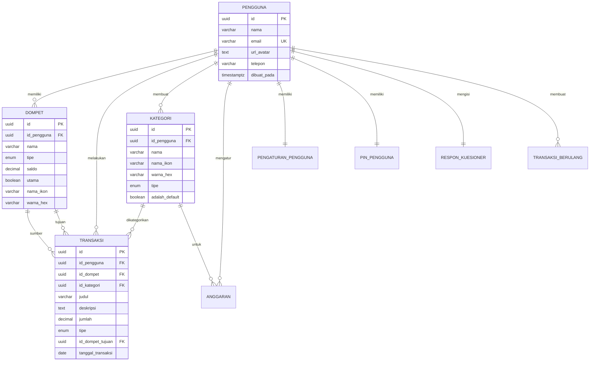

# DahuKu 💰

<div align="center">

Aplikasi manajemen keuangan pribadi berbasis Flutter dengan fitur **offline-first** dan **edukasi finansial** melalui komik interaktif.

[](https://flutter.dev)
[](https://dart.dev)
[](https://supabase.com)
[](https://bloclibrary.dev)
[](LICENSE)

</div>

---

## 📋 Daftar Isi

- [Screenshots](#-screenshots)
- [Fitur Utama](#-fitur-utama)
- [Arsitektur](#-arsitektur)
- [Tech Stack](#-tech-stack)
- [Struktur Project](#-struktur-project)
- [Database Schema](#-database-schema)
- [Getting Started](#-getting-started)
- [Konfigurasi Environment](#-konfigurasi-environment)
- [State Management](#-state-management)
- [Offline Support](#-offline-support)
- [API Reference](#-api-reference)
- [Testing](#-testing)
- [Build & Deployment](#-build--deployment)
- [Contributing](#-contributing)
- [Troubleshooting](#-troubleshooting)
- [Changelog](#-changelog)
- [License](#-license)

---

## 📱 Screenshots

<div align="center">

|                Onboarding                 |                Dashboard                |                Analytics                |
| :---------------------------------------: | :-------------------------------------: | :-------------------------------------: |
|  |  |  |

|                Transaksi                |                Education                |               Profile               |
| :-------------------------------------: | :-------------------------------------: | :---------------------------------: |
|  |  |  |

</div>

> 💡 **Catatan**: Tambahkan screenshot di folder `screenshots/`

---

## ✨ Fitur Utama

### 🏠 Dashboard

| Fitur                   | Deskripsi                                              |
| ----------------------- | ------------------------------------------------------ |
| **Multi-Wallet**        | Kelola 3 jenis dompet: Belanja, Tabungan, Dana Darurat |
| **Quick Summary**       | Ringkasan pengeluaran harian/mingguan/bulanan          |
| **Recent Transactions** | Daftar 5 transaksi terbaru dengan quick access         |
| **Wallet Cards**        | Visualisasi saldo tiap wallet dengan warna berbeda     |

### 📊 Analytics & Reports

| Fitur                   | Deskripsi                                 |
| ----------------------- | ----------------------------------------- |
| **Expense Chart**       | Grafik pengeluaran dalam berbagai periode |
| **Category Breakdown**  | Pie chart spending per kategori           |
| **Transaction History** | Filter & search riwayat transaksi         |
| **Monthly Comparison**  | Perbandingan pengeluaran antar bulan      |

### 💸 Manajemen Transaksi

| Fitur          | Deskripsi                                    |
| -------------- | -------------------------------------------- |
| **Quick Add**  | Catat pemasukan/pengeluaran dengan cepat     |
| **Transfer**   | Pindah uang antar wallet                     |
| **Categories** | 13 kategori default + custom kategori        |
| **Recurring**  | Transaksi berulang (harian/mingguan/bulanan) |

### 📚 Education (Komik Finansial)

| Fitur                  | Deskripsi                      |
| ---------------------- | ------------------------------ |
| **Interactive Comics** | Belajar keuangan melalui komik |
| **Financial Tips**     | Tips mengatur keuangan         |
| **Progress Tracking**  | Lacak komik yang sudah dibaca  |

### 🔐 Security & Authentication

| Fitur                  | Deskripsi                    |
| ---------------------- | ---------------------------- |
| **PIN Protection**     | Akses app dengan 6-digit PIN |
| **Biometric Auth**     | Fingerprint/Face ID support  |
| **Secure Storage**     | Data sensitif terenkripsi    |
| **Session Management** | Auto-logout & session expiry |

### 🌐 Offline-First Architecture

| Fitur                   | Deskripsi                         |
| ----------------------- | --------------------------------- |
| **Local Database**      | Hive untuk penyimpanan lokal      |
| **Auto Sync**           | Sinkronisasi otomatis saat online |
| **Conflict Resolution** | Penanganan konflik data           |
| **Offline Indicator**   | Notifikasi status koneksi         |

---

## 🏗 Arsitektur

### Clean Architecture Pattern

```
┌─────────────────────────────────────────────────────────────┐
│                    PRESENTATION LAYER                        │
│  ┌─────────────┐  ┌─────────────┐  ┌─────────────────────┐  │
│  │   Pages     │  │  Widgets    │  │   BLoC / Cubit      │  │
│  └─────────────┘  └─────────────┘  └─────────────────────┘  │
├─────────────────────────────────────────────────────────────┤
│                     DOMAIN LAYER                             │
│  ┌─────────────┐  ┌─────────────┐  ┌─────────────────────┐  │
│  │  Entities   │  │  Use Cases  │  │   Repositories      │  │
│  └─────────────┘  └─────────────┘  │   (Interfaces)      │  │
│                                     └─────────────────────┘  │
├─────────────────────────────────────────────────────────────┤
│                      DATA LAYER                              │
│  ┌─────────────┐  ┌─────────────┐  ┌─────────────────────┐  │
│  │   Models    │  │ Repositories│  │   Data Sources      │  │
│  │             │  │   (Impl)    │  │  Remote │  Local    │  │
│  └─────────────┘  └─────────────┘  └─────────────────────┘  │
├─────────────────────────────────────────────────────────────┤
│                      CORE LAYER                              │
│  ┌─────────────┐  ┌─────────────┐  ┌─────────────────────┐  │
│  │   Theme     │  │     DI      │  │     Services        │  │
│  └─────────────┘  └─────────────┘  └─────────────────────┘  │
└─────────────────────────────────────────────────────────────┘
```

### Data Flow

```
User Action → BLoC Event → Use Case → Repository → Data Source
                                                       ↓
UI Update  ←  BLoC State  ←  Entity  ←  Repository  ← Response
```

---

## 🛠 Tech Stack

### Core Framework

| Technology | Version | Purpose                     |
| ---------- | ------- | --------------------------- |
| Flutter    | 3.9+    | Cross-platform UI framework |
| Dart       | 3.0+    | Programming language        |

### State Management

| Package      | Version | Purpose                     |
| ------------ | ------- | --------------------------- |
| flutter_bloc | ^9.1.1  | BLoC pattern implementation |
| bloc         | ^9.0.0  | Core BLoC library           |
| equatable    | ^2.0.7  | Value equality for states   |

### Backend & Database

| Package            | Version | Purpose                  |
| ------------------ | ------- | ------------------------ |
| supabase_flutter   | ^2.8.4  | Backend-as-a-Service     |
| hive_flutter       | ^1.1.0  | Local NoSQL database     |
| shared_preferences | ^2.3.4  | Simple key-value storage |

### Security

| Package                | Version | Purpose                              |
| ---------------------- | ------- | ------------------------------------ |
| flutter_secure_storage | ^9.2.4  | Encrypted storage for sensitive data |

### Utilities

| Package           | Version | Purpose                           |
| ----------------- | ------- | --------------------------------- |
| get_it            | ^8.0.3  | Dependency injection              |
| connectivity_plus | ^6.1.4  | Network connectivity detection    |
| google_fonts      | ^6.1.0  | Custom typography                 |
| intl              | ^0.19.0 | Internationalization & formatting |
| flutter_dotenv    | ^5.2.1  | Environment variables             |
| skeletonizer      | ^1.4.2  | Loading skeleton UI               |

### Dev Dependencies

| Package                | Version | Purpose                 |
| ---------------------- | ------- | ----------------------- |
| flutter_lints          | ^5.0.0  | Code analysis           |
| hive_generator         | ^2.0.1  | Hive adapter generation |
| build_runner           | ^2.4.9  | Code generation         |
| flutter_launcher_icons | ^0.14.4 | App icon generation     |

---

## 📁 Struktur Project

```
dahuku_app/
├── 📁 android/                 # Android native code
├── 📁 ios/                     # iOS native code
├── 📁 assets/
│   └── 📁 images/              # Image assets
├── 📁 lib/
│   ├── 📁 core/                # Core utilities
│   │   ├── 📁 di/              # Dependency injection setup
│   │   ├── 📁 local_storage/   # Hive setup & adapters
│   │   ├── 📁 services/        # App-wide services
│   │   └── 📁 theme/           # App theming (colors, text styles)
│   │
│   ├── 📁 features/            # Feature modules
│   │   ├── 📁 account/         # User profile & settings
│   │   │   ├── 📁 bloc/        # Account state management
│   │   │   ├── 📁 data/        # Data layer
│   │   │   └── 📁 presentation/# UI components
│   │   │
│   │   ├── 📁 analytics/       # Analytics & reports
│   │   │   ├── 📁 bloc/
│   │   │   ├── 📁 data/
│   │   │   └── 📁 presentation/
│   │   │       └── 📁 components/
│   │   │
│   │   ├── 📁 boardingfeature/ # Onboarding flow
│   │   │   ├── 📁 auth/        # Login & Register
│   │   │   │   ├── 📁 bloc/
│   │   │   │   ├── 📁 data/
│   │   │   │   └── 📁 presentation/
│   │   │   ├── 📁 onboarding/  # Intro screens
│   │   │   ├── 📁 pin/         # PIN authentication
│   │   │   ├── 📁 questionnaire/# Initial user questionnaire
│   │   │   └── 📁 splash/      # Splash screen
│   │   │
│   │   ├── 📁 dashboard/       # Main dashboard
│   │   │   ├── 📁 bloc/
│   │   │   ├── 📁 pindah_uang/ # Transfer feature
│   │   │   ├── 📁 presentation/
│   │   │   │   ├── 📁 components/
│   │   │   │   └── 📁 pages/
│   │   │   └── 📁 transaction/ # Add transaction
│   │   │
│   │   └── 📁 education/       # Financial education comics
│   │       ├── 📁 bloc/
│   │       ├── 📁 data/
│   │       └── 📁 presentation/
│   │
│   ├── 📄 app.dart             # App routes & MaterialApp config
│   ├── 📄 main.dart            # Entry point
│   └── 📄 main_shell_page.dart # Bottom navigation shell
│
├── 📁 test/                    # Unit & widget tests
├── 📄 .env                     # Environment variables (git ignored)
├── 📄 .env.example             # Environment template
├── 📄 pubspec.yaml             # Dependencies
├── 📄 supabase_schema.sql      # Database schema
└── 📄 README.md                # This file
```

---

## 🗄 Database Schema

### Entity Relationship Diagram



### Tabel Database

#### 1. `pengguna` - Data User

| Column            | Type         | Description                |
| ----------------- | ------------ | -------------------------- |
| `id`              | UUID (PK)    | User ID dari Supabase Auth |
| `nama`            | VARCHAR(100) | Nama lengkap               |
| `email`           | VARCHAR(255) | Email (unique)             |
| `url_avatar`      | TEXT         | URL foto profil            |
| `telepon`         | VARCHAR(20)  | Nomor telepon              |
| `dibuat_pada`     | TIMESTAMPTZ  | Waktu registrasi           |
| `diperbarui_pada` | TIMESTAMPTZ  | Waktu update terakhir      |

#### 2. `dompet` - Wallet/Dompet

| Column        | Type          | Description                      |
| ------------- | ------------- | -------------------------------- |
| `id`          | UUID (PK)     | Wallet ID                        |
| `id_pengguna` | UUID (FK)     | Owner user                       |
| `nama`        | VARCHAR(50)   | Nama wallet                      |
| `tipe`        | ENUM          | `belanja`, `tabungan`, `darurat` |
| `saldo`       | DECIMAL(15,2) | Saldo saat ini                   |
| `utama`       | BOOLEAN       | Wallet utama                     |
| `nama_ikon`   | VARCHAR(50)   | Material icon name               |
| `warna_hex`   | VARCHAR(7)    | Hex color code                   |

#### 3. `kategori` - Kategori Transaksi

| Column           | Type        | Description                            |
| ---------------- | ----------- | -------------------------------------- |
| `id`             | UUID (PK)   | Category ID                            |
| `id_pengguna`    | UUID (FK)   | null = default category                |
| `nama`           | VARCHAR(50) | Nama kategori                          |
| `nama_ikon`      | VARCHAR(50) | Material icon name                     |
| `warna_hex`      | VARCHAR(7)  | Hex color code                         |
| `tipe`           | ENUM        | `pemasukan`, `pengeluaran`, `transfer` |
| `adalah_default` | BOOLEAN     | Kategori bawaan                        |

**Kategori Default:**

| Pengeluaran   | Icon             | Color   |
| ------------- | ---------------- | ------- |
| Makan & Minum | restaurant       | #FF6B6B |
| Transportasi  | directions_car   | #4ECDC4 |
| Belanja       | shopping_bag     | #FFE66D |
| Tagihan       | receipt_long     | #95E1D3 |
| Hiburan       | movie            | #DDA0DD |
| Kesehatan     | medical_services | #98D8C8 |
| Pendidikan    | school           | #F7DC6F |
| Lainnya       | more_horiz       | #BDC3C7 |

| Pemasukan | Icon          | Color   |
| --------- | ------------- | ------- |
| Gaji      | payments      | #2ECC71 |
| Bonus     | card_giftcard | #27AE60 |
| Investasi | trending_up   | #1ABC9C |
| Freelance | work          | #16A085 |
| Lainnya   | add_circle    | #3498DB |

#### 4. `transaksi` - Transaction Records

| Column              | Type          | Description                            |
| ------------------- | ------------- | -------------------------------------- |
| `id`                | UUID (PK)     | Transaction ID                         |
| `id_pengguna`       | UUID (FK)     | User who made transaction              |
| `id_dompet`         | UUID (FK)     | Source wallet                          |
| `id_kategori`       | UUID (FK)     | Category                               |
| `judul`             | VARCHAR(100)  | Transaction title                      |
| `deskripsi`         | TEXT          | Optional description                   |
| `jumlah`            | DECIMAL(15,2) | Amount                                 |
| `tipe`              | ENUM          | `pemasukan`, `pengeluaran`, `transfer` |
| `id_dompet_tujuan`  | UUID (FK)     | Target wallet (for transfer)           |
| `tanggal_transaksi` | DATE          | Transaction date                       |

#### 5. `transaksi_berulang` - Recurring Transactions

| Column                     | Type      | Description                                |
| -------------------------- | --------- | ------------------------------------------ |
| `id`                       | UUID (PK) | Recurring transaction ID                   |
| `frekuensi`                | ENUM      | `harian`, `mingguan`, `bulanan`, `tahunan` |
| `hari_dalam_bulan`         | INT       | 1-31 for monthly                           |
| `hari_dalam_minggu`        | INT       | 0-6 for weekly                             |
| `tanggal_mulai`            | DATE      | Start date                                 |
| `tanggal_selesai`          | DATE      | End date (nullable)                        |
| `tanggal_jalan_berikutnya` | DATE      | Next execution date                        |
| `aktif`                    | BOOLEAN   | Is active                                  |

#### 6. `anggaran` - Budget

| Column          | Type          | Description                        |
| --------------- | ------------- | ---------------------------------- |
| `id`            | UUID (PK)     | Budget ID                          |
| `id_pengguna`   | UUID (FK)     | Owner                              |
| `id_kategori`   | UUID (FK)     | Category (nullable = total budget) |
| `jumlah`        | DECIMAL(15,2) | Budget amount                      |
| `bulan_periode` | INT           | Month (1-12)                       |
| `tahun_periode` | INT           | Year                               |

#### 7. `pengaturan_pengguna` - User Settings

| Column             | Type        | Default  | Description        |
| ------------------ | ----------- | -------- | ------------------ |
| `mode_offline`     | BOOLEAN     | false    | Force offline mode |
| `ukuran_font`      | VARCHAR(10) | 'sedang' | kecil/sedang/besar |
| `kontras_tinggi`   | BOOLEAN     | false    | High contrast mode |
| `bahasa`           | VARCHAR(5)  | 'id'     | Language code      |
| `notifikasi_aktif` | BOOLEAN     | true     | Push notifications |
| `biometrik_aktif`  | BOOLEAN     | false    | Biometric auth     |

#### 8. `respon_kuesioner` - Initial Setup Data

| Column                | Type        | Description                     |
| --------------------- | ----------- | ------------------------------- |
| `saldo_awal_belanja`  | DECIMAL     | Initial spending wallet balance |
| `saldo_awal_tabungan` | DECIMAL     | Initial savings balance         |
| `saldo_awal_darurat`  | DECIMAL     | Initial emergency fund          |
| `punya_hutang`        | BOOLEAN     | Has debt                        |
| `jumlah_hutang`       | DECIMAL     | Debt amount                     |
| `tipe_hutang`         | VARCHAR(50) | Debt type                       |

#### 9. `pin_pengguna` - PIN Authentication

| Column            | Type          | Description        |
| ----------------- | ------------- | ------------------ |
| `id_pengguna`     | UUID (FK, UK) | One PIN per user   |
| `hash_pin`        | VARCHAR(255)  | Hashed 6-digit PIN |
| `biometrik_aktif` | BOOLEAN       | Biometric enabled  |

### Database Functions

#### `dapatkan_ringkasan_dashboard(p_id_pengguna UUID)`

Returns JSON with dashboard summary:

```json
{
  "total_saldo": 5000000.0,
  "pengeluaran_mingguan": 750000.0,
  "anggaran_bulanan": 3000000.0,
  "terpakai_bulanan": 1500000.0
}
```

### Triggers

#### `trigger_perbarui_saldo_dompet`

Automatically updates wallet balance when transactions are inserted/deleted:

- **INSERT pengeluaran**: Decrease source wallet
- **INSERT pemasukan**: Increase source wallet
- **INSERT transfer**: Decrease source, increase destination
- **DELETE**: Reverse the above operations

### Row Level Security (RLS)

All tables have RLS enabled with policies:

- Users can only access their own data
- Default categories (`adalah_default = TRUE`) are readable by all authenticated users

---

## 🚀 Getting Started

### Prerequisites

Pastikan sudah terinstall:

| Requirement              | Version | Check Command       |
| ------------------------ | ------- | ------------------- |
| Flutter SDK              | 3.9+    | `flutter --version` |
| Dart SDK                 | 3.0+    | `dart --version`    |
| Git                      | Latest  | `git --version`     |
| VS Code / Android Studio | Latest  | -                   |

### Installation Steps

#### 1. Clone Repository

```bash
git clone https://github.com/username/dahuku_app.git
cd dahuku_app
```

#### 2. Install Dependencies

```bash
flutter pub get
```

#### 3. Setup Supabase

1. Buat project baru di [Supabase Dashboard](https://supabase.com/dashboard)
2. Buka **SQL Editor**
3. Copy seluruh isi `supabase_schema.sql`
4. Paste dan jalankan di SQL Editor
5. Verify tabel sudah terbuat di **Table Editor**

#### 4. Configure Environment

```bash
# Copy template
cp .env.example .env

# Edit .env dengan credentials kamu
SUPABASE_URL=https://your-project.supabase.co
SUPABASE_ANON_KEY=your-anon-key-here
```

> ⚠️ **PENTING**: Jangan commit file `.env` ke repository!

#### 5. Generate Hive Adapters

```bash
flutter pub run build_runner build --delete-conflicting-outputs
```

#### 6. Run Application

```bash
# Development
flutter run

# Specific device
flutter run -d chrome      # Web
flutter run -d emulator    # Android emulator
flutter run -d simulator   # iOS simulator
```

---

## ⚙️ Konfigurasi Environment

### Environment Variables

| Variable            | Required | Description          |
| ------------------- | -------- | -------------------- |
| `SUPABASE_URL`      | ✅       | URL project Supabase |
| `SUPABASE_ANON_KEY` | ✅       | Anonymous API key    |

### Cara Mendapatkan Credentials

1. Login ke [Supabase Dashboard](https://supabase.com/dashboard)
2. Pilih project kamu
3. Pergi ke **Settings** → **API**
4. Copy **Project URL** → `SUPABASE_URL`
5. Copy **anon/public** key → `SUPABASE_ANON_KEY`

### Multiple Environments

Untuk multiple environments (dev/staging/prod):

```bash
# Development
.env.development

# Staging
.env.staging

# Production
.env.production
```

Update `main.dart`:

```dart
await dotenv.load(fileName: ".env.${environment}");
```

---

## 📦 State Management

### BLoC Pattern

Aplikasi menggunakan **BLoC (Business Logic Component)** pattern untuk state management.

```
┌─────────────────────────────────────────────────────────┐
│                        UI Layer                          │
│  ┌─────────────────────────────────────────────────────┐│
│  │  Widget  ──dispatch──▶  Event                       ││
│  │     ▲                                               ││
│  │     │                                               ││
│  │   build                                             ││
│  │     │                                               ││
│  │  BlocBuilder  ◀──emit──  State  ◀──  BLoC          ││
│  └─────────────────────────────────────────────────────┘│
└─────────────────────────────────────────────────────────┘
```

### Contoh Implementasi

**Event:**

```dart
abstract class DashboardEvent extends Equatable {}

class DashboardLoadRequested extends DashboardEvent {
  @override
  List<Object?> get props => [];
}
```

**State:**

```dart
abstract class DashboardState extends Equatable {}

class DashboardLoading extends DashboardState {}

class DashboardLoaded extends DashboardState {
  final List<Wallet> wallets;
  final List<Transaction> transactions;
}
```

**BLoC:**

```dart
class DashboardBloc extends Bloc<DashboardEvent, DashboardState> {
  DashboardBloc() : super(DashboardInitial()) {
    on<DashboardLoadRequested>(_onLoadRequested);
  }

  Future<void> _onLoadRequested(
    DashboardLoadRequested event,
    Emitter<DashboardState> emit,
  ) async {
    emit(DashboardLoading());
    try {
      final wallets = await repository.getWallets();
      emit(DashboardLoaded(wallets: wallets));
    } catch (e) {
      emit(DashboardError(message: e.toString()));
    }
  }
}
```

---

## 🌐 Offline Support

### Arsitektur Offline-First

```
┌─────────────────────────────────────────────────────────────┐
│                      Repository                              │
│                          │                                   │
│              ┌───────────┴───────────┐                      │
│              ▼                       ▼                       │
│     ┌─────────────┐         ┌─────────────┐                 │
│     │    Local    │         │   Remote    │                 │
│     │ DataSource  │         │ DataSource  │                 │
│     │   (Hive)    │         │ (Supabase)  │                 │
│     └─────────────┘         └─────────────┘                 │
└─────────────────────────────────────────────────────────────┘
```

### Strategi Sinkronisasi

1. **Write to Local First**
   - Semua write operation masuk ke Hive dulu
   - Marked as `pending_sync`

2. **Background Sync**
   - `SyncService` berjalan di background
   - Check koneksi dengan `connectivity_plus`
   - Upload pending changes ke Supabase

3. **Conflict Resolution**
   - Server timestamp wins (last-write-wins)
   - Atau custom merge strategy

### Penggunaan

```dart
// Check offline status
final isOffline = context.read<OfflineModeCubit>().state;

// Force offline mode
context.read<OfflineModeCubit>().setOfflineMode(true);
```

---

## 📡 API Reference

### Supabase Tables

#### Read Operations

```dart
// Get all wallets
final response = await supabase
    .from('dompet')
    .select()
    .eq('id_pengguna', userId);

// Get transactions with category
final response = await supabase
    .from('transaksi')
    .select('*, kategori(*)')
    .eq('id_pengguna', userId)
    .order('tanggal_transaksi', ascending: false);
```

#### Write Operations

```dart
// Insert transaction
await supabase.from('transaksi').insert({
  'id_pengguna': userId,
  'id_dompet': walletId,
  'judul': 'Makan Siang',
  'jumlah': 50000,
  'tipe': 'pengeluaran',
  'tanggal_transaksi': DateTime.now().toIso8601String(),
});
```

#### RPC Functions

```dart
// Get dashboard summary
final summary = await supabase
    .rpc('dapatkan_ringkasan_dashboard', params: {
      'p_id_pengguna': userId,
    });
```

---

## 🧪 Testing

### Unit Tests

```bash
# Run all tests
flutter test

# Run specific test file
flutter test test/features/dashboard/bloc/dashboard_bloc_test.dart

# With coverage
flutter test --coverage
```

### Widget Tests

```dart
testWidgets('Dashboard shows wallet cards', (tester) async {
  await tester.pumpWidget(
    MaterialApp(
      home: BlocProvider(
        create: (_) => mockDashboardBloc,
        child: DashboardPage(),
      ),
    ),
  );

  expect(find.byType(WalletCard), findsNWidgets(3));
});
```

### Integration Tests

```bash
flutter test integration_test/app_test.dart
```

---

## 🏗 Build & Deployment

### Development Build

```bash
# Android
flutter run

# iOS
flutter run -d simulator

# Web (Chrome)
flutter run -d chrome
```

### Production Build

#### Android APK

```bash
flutter build apk --release

# Output: build/app/outputs/flutter-apk/app-release.apk
```

#### Android App Bundle (Play Store)

```bash
flutter build appbundle --release

# Output: build/app/outputs/bundle/release/app-release.aab
```

#### iOS (App Store)

```bash
flutter build ios --release

# Then open in Xcode and archive
open ios/Runner.xcworkspace
```

#### Web

```bash
flutter build web --release

# Output: build/web/
```

### App Icon Generation

```bash
flutter pub run flutter_launcher_icons
```

Config di `pubspec.yaml`:

```yaml
flutter_launcher_icons:
  android: true
  ios: true
  image_path: "assets/dahukulogo.png"
  min_sdk_android: 21
  remove_alpha_ios: true
```

---

## 🤝 Contributing

### Contribution Guidelines

1. **Fork** repository ini
2. **Create branch** untuk fitur/fix
   ```bash
   git checkout -b feature/amazing-feature
   ```
3. **Commit** dengan pesan yang jelas
   ```bash
   git commit -m "feat: add amazing feature"
   ```
4. **Push** ke branch
   ```bash
   git push origin feature/amazing-feature
   ```
5. **Open Pull Request**

### Commit Message Convention

Format: `<type>: <description>`

| Type       | Description                 |
| ---------- | --------------------------- |
| `feat`     | Fitur baru                  |
| `fix`      | Bug fix                     |
| `docs`     | Dokumentasi                 |
| `style`    | Formatting (no code change) |
| `refactor` | Code refactoring            |
| `test`     | Testing                     |
| `chore`    | Maintenance                 |

### Code Style

- Follow [Effective Dart](https://dart.dev/guides/language/effective-dart)
- Run `flutter analyze` before committing
- Format code with `flutter format .`

---

## 🔧 Troubleshooting

### Common Issues

#### 1. Supabase Connection Error

```
SocketException: Failed to connect to host
```

**Solution:**

- Pastikan URL dan API key benar di `.env`
- Cek koneksi internet
- Verify project Supabase masih aktif

#### 2. Hive Adapter Not Found

```
HiveError: Cannot find adapter for type
```

**Solution:**

```bash
flutter pub run build_runner build --delete-conflicting-outputs
```

#### 3. iOS Build Failed

```
CocoaPods not found
```

**Solution:**

```bash
sudo gem install cocoapods
cd ios && pod install
```

#### 4. Android Gradle Error

```
Could not resolve all dependencies
```

**Solution:**

```bash
cd android
./gradlew clean
cd ..
flutter clean
flutter pub get
```

---

## 📝 Changelog

### v1.0.0 (2024-12-22)

- 🎉 Initial release
- ✅ Dashboard dengan multi-wallet
- ✅ Catat transaksi (pemasukan/pengeluaran/transfer)
- ✅ Analytics dengan chart
- ✅ Education comics
- ✅ Offline-first architecture
- ✅ PIN & biometric authentication

---

## 📜 License

```
MIT License

Copyright (c) 2024 DahuKu

Permission is hereby granted, free of charge, to any person obtaining a copy
of this software and associated documentation files (the "Software"), to deal
in the Software without restriction, including without limitation the rights
to use, copy, modify, merge, publish, distribute, sublicense, and/or sell
copies of the Software, and to permit persons to whom the Software is
furnished to do so, subject to the following conditions:

The above copyright notice and this permission notice shall be included in all
copies or substantial portions of the Software.

THE SOFTWARE IS PROVIDED "AS IS", WITHOUT WARRANTY OF ANY KIND, EXPRESS OR
IMPLIED, INCLUDING BUT NOT LIMITED TO THE WARRANTIES OF MERCHANTABILITY,
FITNESS FOR A PARTICULAR PURPOSE AND NONINFRINGEMENT. IN NO EVENT SHALL THE
AUTHORS OR COPYRIGHT HOLDERS BE LIABLE FOR ANY CLAIM, DAMAGES OR OTHER
LIABILITY, WHETHER IN AN ACTION OF CONTRACT, TORT OR OTHERWISE, ARISING FROM,
OUT OF OR IN CONNECTION WITH THE SOFTWARE OR THE USE OR OTHER DEALINGS IN THE
SOFTWARE.
```

---

<div align="center">

**Made with ❤️ using Flutter**

[⬆ Back to Top](#dahuku-)

</div>
